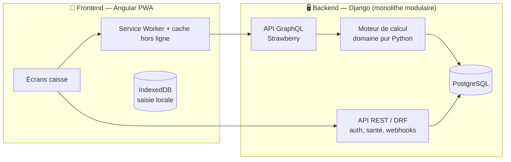
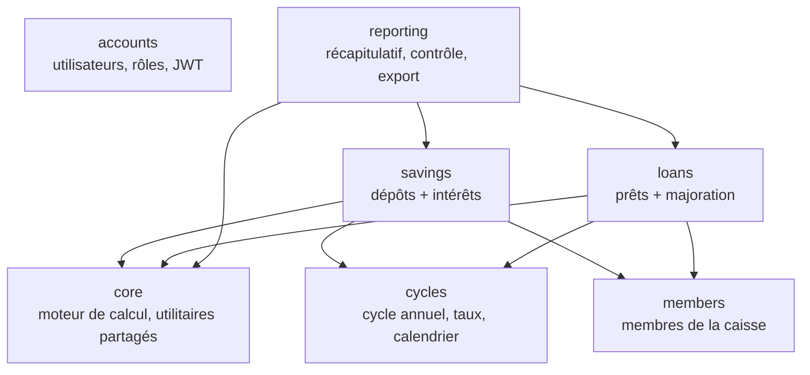

# Documentation d'architecture

**Projet :** Application de gestion de tontines — module Caisse mutuelle (v1)
**Version :** 0.2
**Décision structurante :** monolithe **modulaire** (pas de microservices).

---

## 1. Vue d'ensemble



Un seul dépôt de code, un seul déploiement, une seule base de données. La modularité est **interne** : chaque domaine métier est une app Django isolée, avec ses modèles, sa logique et son schéma GraphQL. On garde ainsi des frontières nettes sans payer le coût opérationnel des microservices — le bon compromis pour un projet solo à petit budget.

---

## 2. Stack technique

| Couche | Choix | Pourquoi |
|---|---|---|
| Frontend | **Angular** + PWA (`@angular/pwa`, service worker) | Choisi par le porteur. Framework structurant, TypeScript, bon pour une app installable hors ligne. |
| Données locales | **IndexedDB** (via `idb` ou Dexie) | Saisie possible sans réseau, synchronisée ensuite. |
| Client GraphQL | **Apollo Angular** | Requêtes/mutations typées, cache client. |
| API principale | **GraphQL** via **Strawberry** (+ `strawberry-django`) | API typée, une seule requête pour composer un écran. Strawberry est moderne et basé sur les type hints Python. *Alternative : Graphene.* |
| API secondaire | **Django REST Framework** | Authentification (JWT), endpoint de santé, futurs webhooks Mobile Money — là où le REST est plus simple que GraphQL. |
| Backend | **Django** (monolithe modulaire) | Choisi par le porteur. Admin intégré (précieux pour la trésorière/support), ORM robuste, migrations. |
| Base de données | **PostgreSQL** (SQLite en dev rapide) | Standard Django, fiable, gratuit. |
| Déploiement | **Docker Compose** sur un petit VPS | Lean, reproductible, peu coûteux. |

> **Sur la cohabitation DRF + GraphQL.** GraphQL porte la logique métier de l'app (lire/écrire dépôts, prêts, récapitulatifs). DRF gère l'authentification et les intégrations techniques. On évite de dupliquer les mêmes opérations dans les deux ; chacun a un rôle clair.

---

## 3. Découpage en modules (apps Django)

Chaque module est une **app Django** = une frontière métier (bounded context). Dépendances orientées vers `core`, jamais l'inverse.



| Module | Responsabilité |
|---|---|
| `core` | **Moteur de calcul** (intérêts, majorations) en Python pur, sans dépendance Django ; types et utilitaires partagés. |
| `accounts` | Utilisateur (trésorière), rôles, authentification JWT. |
| `members` | Membres de la caisse. |
| `cycles` | Le cycle annuel, ses paramètres (mois de début, durée dépôt, taux épargne, taux majoration, délai). |
| `savings` | Dépôts mensuels, calcul et stockage des intérêts. |
| `loans` | Prêts, remboursements, calcul de la majoration. |
| `reporting` | Récapitulatif de clôture, contrôle de la caisse, export/impression. |

---

## 4. Modèle de données

```mermaid
erDiagram
    CAISSE ||--o{ CYCLE : possède
    CYCLE ||--o{ MEMBER : regroupe
    CYCLE ||--o{ DEPOSIT : contient
    CYCLE ||--o{ LOAN : contient
    MEMBER ||--o{ DEPOSIT : effectue
    MEMBER ||--o{ LOAN : contracte
    LOAN ||--o{ REPAYMENT : reçoit

    CAISSE { uuid id PK; string nom }
    CYCLE { uuid id PK; int mois_debut; int duree_depot; decimal taux_epargne; decimal taux_majoration; int mois_delai; string statut }
    MEMBER { uuid id PK; string nom; string telephone }
    DEPOSIT { uuid id PK; uuid member_id FK; int mois_index; decimal montant; date saisi_le }
    LOAN { uuid id PK; uuid member_id FK; decimal montant; int mois_pret; int mois_remboursement }
    REPAYMENT { uuid id PK; uuid loan_id FK; decimal montant; int mois }
```

Principes :

- **`mois_index`** : entier 1..N depuis le mois de début (1 = septembre). Les dépôts vont de 1 à `duree_depot` (9). Les remboursements de prêts peuvent aller jusqu'au délai (12 = août). On stocke des index, pas des dates figées → le cycle reste paramétrable.
- **Taux stockés sur le `CYCLE`**, jamais en dur dans le code. Changer une année = changer un paramètre.
- **Les intérêts et majorations ne sont pas stockés « en brut »** : ils sont **calculés par le moteur** (§5) à partir des dépôts/prêts. On évite les valeurs incohérentes. On peut les figer (snapshot) au moment de la clôture pour l'archive.
- **Montants en entiers (FCFA, pas de centimes)** ou `Decimal` — jamais de `float` pour de l'argent.

---

## 5. Moteur de calcul (le cœur)

Localisé dans `apps/core/domain/` — **Python pur, aucune dépendance Django**, donc testable en isolation et réutilisable (script, tâche, futur portage).

Fonctions principales :

- `taux_a_la_cloture(mois_index, cycle)` → le taux dégressif (45 %… 5 %).
- `interet_depot(montant, mois_index, cycle)` → intérêt d'un dépôt.
- `interets_membre(depots, cycle)` → somme des intérêts d'un membre.
- `majoration_pret(montant, mois_pret, mois_remboursement, cycle)` → majoration d'un prêt (défaut : délai si non remboursé).
- `position_nette_membre(...)` → épargne + intérêts − dettes.

**La règle d'ajustement des intérêts** (spec §5, désormais tranchée) vit ici, sous forme de stratégie enfichable (`RepartitionInterets`). Quatre modes sont implémentés et testés : `InteretsComplets`, `InteretsReductionMois(n)`, `InteretsEquitableProrata(...)` et `InteretsEquitableEgal(...)`, avec les aides `total_majorations(...)` et `suggerer_reduction_mois(...)`. Le mode est choisi à la clôture sur le Récapitulatif, **sans toucher au reste de l'app**.

Ces fonctions reproduisent exactement les calculs déjà vérifiés dans le classeur `Caisse-Mutuelle-Calculatrice.xlsx`, et sont couvertes par des tests unitaires (`apps/core/domain/tests_interest.py`).

---

## 6. Stratégie hors ligne (offline-first)

Exigence forte : saisir même sans réseau. Approche **progressive**, pour ne pas sur-investir en v1 :

- **Phase 1 (v1) :** PWA installable, service worker qui met en cache l'app (app shell) et les données déjà chargées → l'app s'ouvre et se consulte hors ligne.
- **Phase 2 :** file d'attente de saisie locale (IndexedDB) : les dépôts/prêts saisis hors ligne sont stockés localement puis **synchronisés** via mutations GraphQL quand la connexion revient. Gestion des conflits par « dernière écriture gagne » au niveau de la ligne (suffisant, une seule trésorière saisit).

On documente la Phase 2 dès maintenant, mais on livre la Phase 1 d'abord — cohérent avec le budget.

---

## 7. Sécurité et rôles

- **Authentification** JWT (DRF SimpleJWT). En v1, un seul rôle : **trésorière** (accès complet à sa caisse).
- **Rôle `membre`** (lecture seule de ses propres comptes) prévu structurellement, activé plus tard.
- **Cloisonnement des données** par caisse (une trésorière ne voit que sa caisse).
- **HTTPS obligatoire**, secrets hors du dépôt (`.env`), mots de passe hachés (défaut Django).
- **Traçabilité** : horodatage de chaque saisie (rôle de preuve, cf. spec).

---

## 8. Déploiement (lean)

- **Docker Compose** : services `web` (Django/Gunicorn), `db` (PostgreSQL), plus tard `frontend` (build Angular servi en statique) et un reverse-proxy (Caddy/Nginx, HTTPS automatique).
- **Cible :** un petit VPS (~5 000–10 000 FCFA/mois) ou un hébergement gratuit au départ.
- **Frontend** : build statique déployable sur Netlify/Vercel/Cloudflare Pages (gratuit) pointant vers l'API.
- **Migrations** Django versionnées ; sauvegarde régulière de PostgreSQL.

---

## 9. Arborescence du dépôt

```
tontine-app/
├── docs/
│   ├── 01-specification-fonctionnelle.md
│   └── 02-architecture.md
├── backend/
│   ├── config/                 # projet Django (settings modulaires, urls, schema GraphQL racine)
│   ├── apps/
│   │   ├── core/               # moteur de calcul (domaine pur) + tests
│   │   ├── accounts/           # auth, rôles
│   │   ├── members/            # membres
│   │   ├── cycles/             # cycle annuel, paramètres
│   │   ├── savings/            # dépôts + intérêts (+ schema GraphQL)
│   │   └── loans/              # prêts + majoration
│   ├── requirements.txt
│   ├── docker-compose.yml
│   ├── Dockerfile
│   └── manage.py
└── frontend/
    ├── src/app/core/domain/    # modèles TypeScript du domaine
    ├── src/app/core/graphql/   # requêtes/mutations GraphQL
    └── README.md               # commandes ng + structure
```

---

## 10. Feuille de route technique

1. **v1 — Caisse mutuelle** (ce document) : backend modulaire + moteur de calcul testé, écrans de saisie, récapitulatif, PWA installable.
2. Consultation membre (lecture seule) + export PDF de clôture.
3. Synchronisation hors ligne robuste (Phase 2).
4. Module **Tontine rotative** (cotisations, tours, rappels).
5. Intégration Mobile Money (fonds hors app), i18n anglais.

---

## 11. Décisions d'architecture (résumé)

| Décision | Statut |
|---|---|
| Monolithe modulaire (apps Django) plutôt que microservices | **Acté** — adapté au projet solo, faible coût opérationnel |
| Angular PWA / Django-DRF / GraphQL / PostgreSQL | **Acté** (choix du porteur) |
| GraphQL = métier, DRF = auth/technique | **Acté** pour GraphQL (implémenté) ; auth DRF/JWT pas encore branchée |
| Bibliothèque GraphQL : Strawberry | **Acté** (implémenté) |
| Moteur de calcul en Python pur, isolé de Django | **Acté** (implémenté et testé ; 4 modes d'intérêts enfichables) |
| Offline-first en 2 phases | Proposé |
